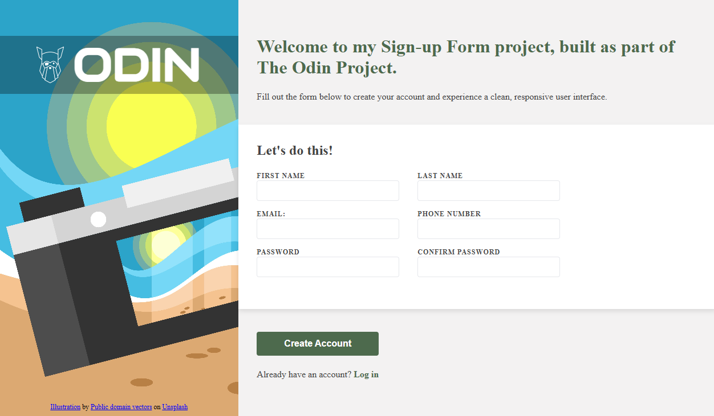

# Sign-up Form

A desktop sign-up page built as part of **The Odin Project – Intermediate HTML and CSS** course. This project focuses on translating a design mockup into a clean, semantic, and responsive layout using HTML and CSS.

## Live Demo

🔗 **Live Demo:** https://jadecodelab.github.io/Sign-up-form/

## Preview

> Add a screenshot here.

```md

```

## Built With

- HTML5
- CSS3
- Flexbox

## What I Learned

Through this project I practiced:

- Planning HTML structure before writing CSS
- Building page layouts with Flexbox
- Creating accessible forms with semantic HTML
- Styling form inputs, buttons, and focus states
- Organizing CSS for readability and maintainability

## Acknowledgements

- **The Odin Project** for the project specification and learning materials.
- Background image by **Public Domain Vectors** on **Unsplash**.
